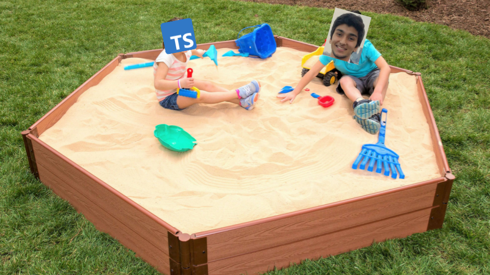

# 🏖 project-sndbx
sndbx (sandbox) is a full stack web app where I play with different technologies and concepts - to learn **new stuff** and refresh my **fundementals**

## currently playing with...
- frontend
  - react w/ typescript
  - auth
  - architectures (MVVM vs MVC)

- backend
  - auth
  - database design

## planning to play with...
- frontend
  - Progressive Web App (PWA)

- backend
  - go vs node

## already played with...
- react-fartscroll ( added this to show my nephew that coding is fun )